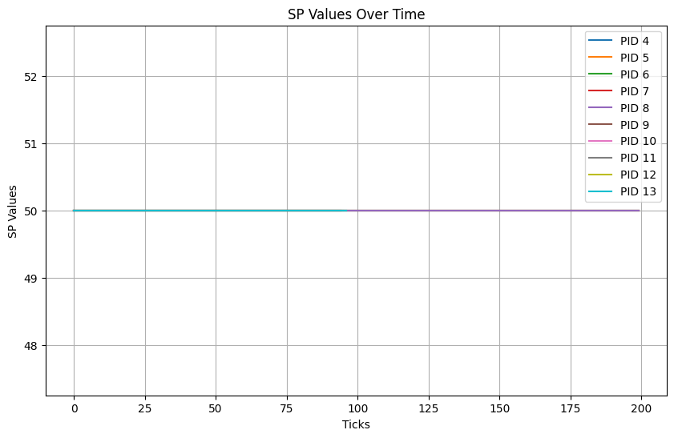
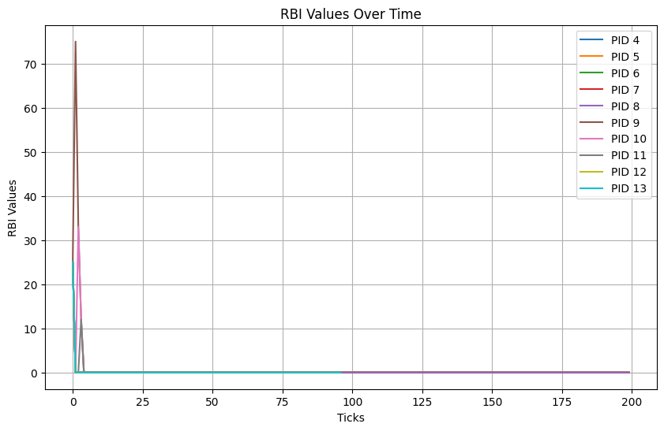
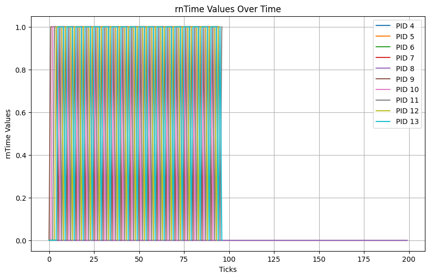
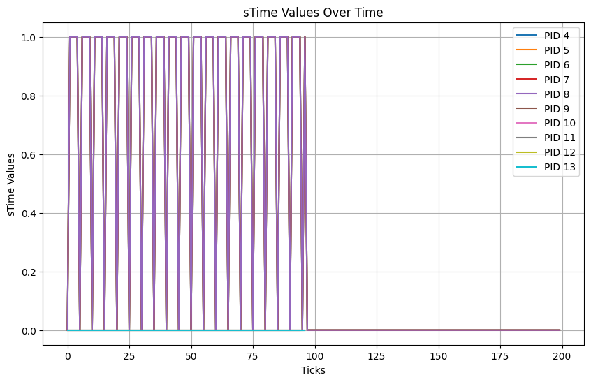
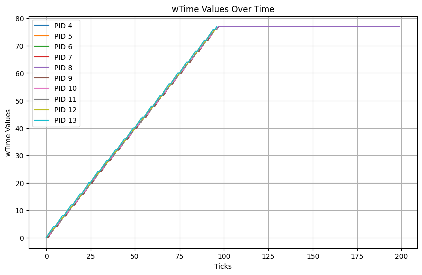
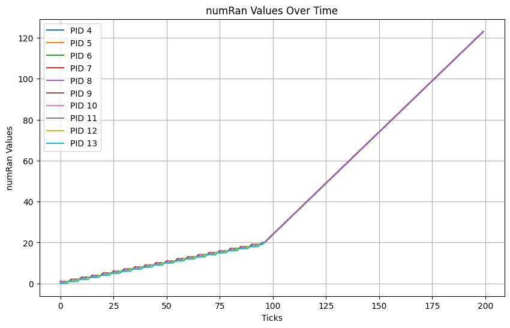

# Priority Based Scheduler in xv-6

There are two types of priorities - 
Static Priority (SP) and
Dynamic Priority (DP). 

DP is dependent on three variables - rTime, sTime and wTime.

```rTime``` - total time the process has been running since it was last scheduled.

```sTime``` - total time the process has spent sleeping (i.e., blocked and not using CPU time) since it was last scheduled.

```wTime``` - total time the process has spent in the ready queue waiting to be scheduled since creation.


A new system call called ```setpriority``` that takes in two arguments - ```pid``` and ```new_sp``` and sets the SP of the given process with the new value.


It was observed that ```rTime``` was most of the times equal to zero. The max it went was to one. This is because the scheduler is pre-emptive. Thus at every clock tick, the ```rTime``` is reset to zero.

If two processes have the same DP, then the one that was scheduled the least number of times is given higher priority.

The plots of the various variables with time are given below.

|                            |                             | 
|       :-----------:        |       :------------:        |
|     |     | 
|  |   | 
|  |  | 


Due to the pre-emptive nature of the scheduler, ```DP``` loses its significance and is equal to ```SP``` most times.

The only time ```RBI``` is relevant is when the process is created, as the ```RBI``` takes its default value of 25.

All these plots are obtained by running the default schedulertest on a multi-core CPU.
